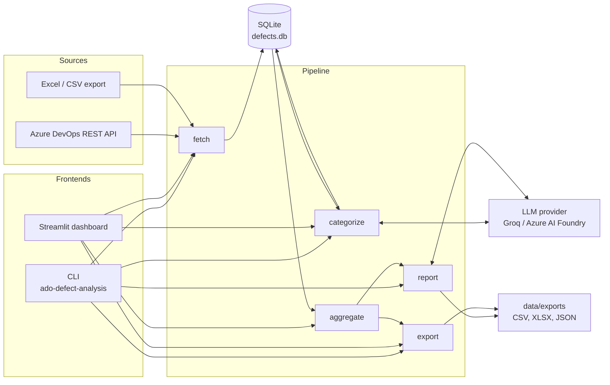
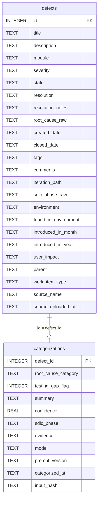
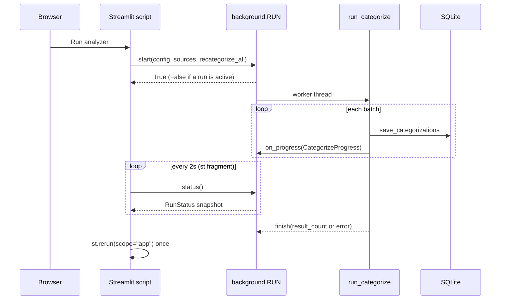

# Architecture

How ADO Defect LLM Analysis is put together: the components, how data moves
between them, the external APIs it calls, and the Python and CLI surfaces it
exposes. For setup and usage see [README.md](README.md); for the build history
see [docs/PHASE-PLAN.md](docs/PHASE-PLAN.md).

## Contents

1. [Overview](#1-overview)
2. [Components](#2-components)
3. [Pipeline data flow](#3-pipeline-data-flow)
4. [Data model](#4-data-model)
5. [External APIs consumed](#5-external-apis-consumed)
6. [LLM contracts](#6-llm-contracts)
7. [Python API](#7-python-api)
8. [CLI](#8-cli)
9. [Dashboard](#9-dashboard)
10. [Configuration and secrets](#10-configuration-and-secrets)
11. [Reliability and error handling](#11-reliability-and-error-handling)
12. [Extending](#12-extending)
13. [Testing](#13-testing)

## 1. Overview

The tool is a batch pipeline with two front ends (a CLI and a Streamlit
dashboard) over one SQLite database. It does not serve an HTTP API of its own.
"API" in this document means three things:

- the **external REST APIs it calls** (Azure DevOps and an OpenAI-compatible
  LLM endpoint) — section 5,
- the **JSON contracts** it holds the LLM to — section 6,
- the **Python functions and CLI commands** other code or people call —
  sections 7 and 8.



The design rule behind the layout: the LLM makes judgment calls (root cause,
SDLC phase, testing gap, narrative), and everything countable is computed
deterministically in pandas. Corrective/preventive actions are a static lookup
([capa.py](src/ado_defect_analysis/capa.py)), not generated.

## 2. Components

All code lives under [src/ado_defect_analysis/](src/ado_defect_analysis/).

| Layer | Module | Responsibility |
|-------|--------|----------------|
| Entry | [cli.py](src/ado_defect_analysis/cli.py) | Argument parsing; dispatches to pipeline stages, the dashboard launcher, and secrets management |
| Entry | [dashboard/streamlit_app.py](src/ado_defect_analysis/dashboard/streamlit_app.py) | Routes between the setup page and the leadership dashboard |
| Config | [config.py](src/ado_defect_analysis/config.py) | `Config`, `AdoConfig`, `LlmConfig` dataclasses built from environment variables |
| Config | [secrets.py](src/ado_defect_analysis/secrets.py) | Credential lookup: environment first, then the OS credential store |
| Ingest | [ado_client.py](src/ado_defect_analysis/ado_client.py) | Azure DevOps REST client (WIQL, saved queries, batch work-item read, comments) |
| Ingest | [ado_query.py](src/ado_defect_analysis/ado_query.py) | Parses a pasted ADO query URL into organization, project, and query id or path |
| Ingest | [excel_source.py](src/ado_defect_analysis/excel_source.py) | Parses a hand-exported `.xlsx`/`.xls`/`.xlsm`/`.csv` into `Defect` objects |
| Transport | [http.py](src/ado_defect_analysis/http.py) | Shared `requests.Session` with retry and backoff |
| LLM | [llm/base.py](src/ado_defect_analysis/llm/base.py) | `LlmProvider` interface and `TokenUsage` accounting |
| LLM | [llm/openai_compatible.py](src/ado_defect_analysis/llm/openai_compatible.py) | Shared chat-completions transport |
| LLM | [llm/groq_provider.py](src/ado_defect_analysis/llm/groq_provider.py), [llm/azure_provider.py](src/ado_defect_analysis/llm/azure_provider.py) | Thin subclasses supplying endpoint and error wording |
| LLM | [llm/factory.py](src/ado_defect_analysis/llm/factory.py) | Maps `LLM_PROVIDER` to provider instances; the only module that knows provider names |
| Domain | [models.py](src/ado_defect_analysis/models.py) | `Defect` and `DefectCategorization` dataclasses, HTML stripping |
| Domain | [capa.py](src/ado_defect_analysis/capa.py) | Static corrective/preventive actions and the dev-quality vs process bucket per category |
| Storage | [storage.py](src/ado_defect_analysis/storage.py) | `DefectStore`: schema, in-place migrations, upserts, queries |
| Pipeline | [pipeline/fetch.py](src/ado_defect_analysis/pipeline/fetch.py) | Source → SQLite |
| Pipeline | [pipeline/categorize.py](src/ado_defect_analysis/pipeline/categorize.py) | Batched LLM classification with validation and provenance |
| Pipeline | [pipeline/aggregate.py](src/ado_defect_analysis/pipeline/aggregate.py) | Deterministic statistics from categorized defects |
| Pipeline | [pipeline/report.py](src/ado_defect_analysis/pipeline/report.py) | LLM narrative over the aggregates |
| Pipeline | [pipeline/export.py](src/ado_defect_analysis/pipeline/export.py) | CSV/XLSX export and the needs-review list |
| Runtime | [background.py](src/ado_defect_analysis/background.py) | Runs categorization on a thread that outlives the browser session |
| Assets | [prompts/](src/ado_defect_analysis/prompts/), [schemas/](src/ado_defect_analysis/schemas/) | Prompt templates and JSON Schemas, shipped as package data |

Dependency direction is one-way: entry points → pipeline → (ingest, LLM,
storage) → (config, models, http). Pipeline stages depend on the `LlmProvider`
interface, never on a vendor module.

## 3. Pipeline data flow

| Stage | Input | Work | Output |
|-------|-------|------|--------|
| **fetch** | ADO API, saved ADO query, or Excel/CSV file | Normalizes to `Defect`, strips HTML, stamps `source_name` and `source_uploaded_at` | Upsert into `defects` by id |
| **categorize** | Defects with no categorization (or all, with `recategorize_all`) | Batches defects, calls the LLM, validates against the schema, records provenance | Upsert into `categorizations` by defect id |
| **aggregate** | `defects` joined with `categorizations` | pandas statistics; no network calls | A plain `dict` |
| **report** | The aggregates dict | One LLM call for an executive narrative | `narrative_summary.json` |
| **export** | The joined dataframe | Writes files; filters the needs-review subset | `categorized_defects.csv`, `.xlsx`, `needs_review.csv` |

### Categorization details

- **Batching.** `LLM_CATEGORIZE_BATCH_SIZE` defects per call (default 10).
  `LLM_BATCH_STRATEGY=fixed` chunks in arrival order; `module` groups by area
  path first.
- **Concurrency.** One provider instance per Groq key. Worker count is
  `min(LLM_MAX_CONCURRENCY, number of providers)`, default 1. Each provider is
  checked out to one worker at a time through a queue, because a provider owns
  a session and a usage counter. SQLite writes happen only on the calling
  thread.
- **Skip unchanged work.** Each categorization stores `input_hash` (SHA-256 of
  the exact payload the model saw, first 16 hex chars), `prompt_version`
  (SHA-256 of the prompt file, first 12 hex chars), and `model`. A
  `recategorize_all` run skips a defect when all three match, unless `force`
  is set.
- **Validation.** The response is checked with `jsonschema` (Draft 2020-12).
  By default a violation is logged and handled leniently: an invalid category
  or phase becomes `unknown`, a non-numeric confidence becomes `0.0`, an
  out-of-range one is clamped to 0–1. `LLM_STRICT_SCHEMA=true` rejects the
  batch instead. A batch that omits any defect id it was sent always fails.
- **Needs review.** A row is flagged when confidence is below
  `REVIEW_CONFIDENCE_THRESHOLD` (default 0.6) or either the category or the
  phase is `unknown`.

### Aggregates produced

`build_aggregates` returns these keys:

| Key | Meaning |
|-----|---------|
| `total_defects` | Row count |
| `root_cause_distribution` | Count per root-cause category |
| `module_density` | Count per area path |
| `monthly_trend` | Count per closed month (`YYYY-MM`) |
| `testing_gap_rate` | Share with `testing_gap_flag` true |
| `area_iteration_distribution` | Area path → iteration path → count |
| `rca_major_contributor` | Per category: the top area path, its count and share |
| `valid_vs_rejected` | `valid`, `rejected`, `borderline` counts |
| `rejection_breakdown` | Count per rejection or borderline reason |
| `rca_pareto` | Categories descending with cumulative share and `in_vital_few` |
| `rca_sdlc_crosstab` | Category → SDLC phase → count |
| `needs_review_count` | Rows flagged for human review |
| `severity_mix` | Counts per severity plus `critical_high` and its rate |
| `escape_rate` | Share whose phase is `build_release` or `production_operations` |
| `top_rca_contributors` | Top 5 categories with top area and CAPA actions |
| `top_area_contributors` | Top 5 areas with dominant cause, rejection rate, CAPA actions |
| `quality_split` | `dev_quality` vs `process_error` vs `unattributed` |

Rejected vs borderline is matched case-insensitively against both `resolution`
and `state`. A specific resolution outranks a generic state, so a defect with
state "Rejected" and resolution "Cannot Reproduce" counts as borderline.

## 4. Data model

SQLite file at `DEFECT_DB_PATH` (default `data/defects.db`), opened in WAL mode
with foreign keys on and a 30-second busy timeout.



- `defects.id` is the ADO work item id. `module` holds the area path.
- Both tables upsert on their primary key, so every stage is safe to re-run.
  Re-uploading a defect re-stamps its `source_name` with the newer upload.
- There is no migration framework. `DefectStore._migrate` adds any column
  listed in `_MIGRATIONS` that an existing file lacks, so an old database
  upgrades in place when it is opened.

## 5. External APIs consumed

Every outbound call goes through the retrying session described in
[section 11](#11-reliability-and-error-handling).

### 5.1 Azure DevOps REST API

| | |
|---|---|
| Base URL | `https://dev.azure.com/{organization}/{project}/_apis` |
| API version | `ADO_API_VERSION`, default `7.1` |
| Auth | HTTP Basic, empty username, the PAT as password |
| PAT scope | Work Items (read) |
| Timeout | `ADO_REQUEST_TIMEOUT_SECONDS`, default 30 |

| # | Method and path | Used for | Request | Response fields read |
|---|-----------------|----------|---------|----------------------|
| 1 | `POST /wit/wiql?api-version=7.1` | Find closed defects from config | `{"query": "<WIQL>"}` | `workItems[].id` |
| 2 | `GET /wit/wiql/{queryId}?api-version=7.1` | Run a saved query by GUID | — | `workItems[].id`, or `workItemRelations[].target.id` for tree queries |
| 3 | `GET /wit/queries/{queryPath}?api-version=7.1` | Resolve a query's folder path to its GUID | — | `id` |
| 4 | `POST /wit/workitemsbatch?api-version=7.1` | Read fields for a chunk of ids | `{"ids": [...], "fields": [...]}` | `value[].id`, `value[].fields` |
| 5 | `GET /wit/workItems/{id}/comments?api-version=7.1-preview.4` | Comment thread, one call per item | — | `comments[].text` |

**WIQL built by call 1:**

```sql
SELECT [System.Id] FROM WorkItems
WHERE [System.WorkItemType] = '<ADO_WORK_ITEM_TYPE>'
  AND [System.State] IN ('Closed', 'Resolved', 'Done')
  AND [System.ChangedDate] >= @Today - <ADO_LOOKBACK_DAYS>
  AND [System.AreaPath] UNDER '<ADO_AREA_PATH>'   -- only when set
ORDER BY [System.ChangedDate] DESC
```

**Fields requested by call 4**, in chunks of `ADO_BATCH_SIZE` (default 200):

| ADO field | `Defect` attribute |
|-----------|--------------------|
| `System.Id` | `id` |
| `System.Title` | `title` |
| `System.Description` | `description` (HTML stripped) |
| `System.AreaPath` | `module` |
| `System.IterationPath` | `iteration_path` |
| `System.State` | `state` |
| `System.CreatedDate` | `created_date` |
| `System.History` | `resolution_notes` (HTML stripped) |
| `System.Tags` | `tags` |
| `Microsoft.VSTS.Common.Severity` | `severity` |
| `Microsoft.VSTS.Common.ClosedDate` | `closed_date` |
| `Microsoft.VSTS.Common.ResolvedReason` | `resolution` |
| `ADO_ROOT_CAUSE_FIELD` (default `Microsoft.VSTS.CMMI.RootCause`) | `root_cause_raw` |

Behaviour worth knowing:

- Call 5 runs only when `ADO_FETCH_COMMENTS=true`. A 4xx or 5xx on it yields an
  empty comment string instead of failing the fetch. Every other call raises
  `AdoClientError` on status 400 or above, with the first 500 characters of the
  response body.
- There is no pagination. WIQL returns up to 20,000 ids in one response; split
  by date range if a project exceeds that.
- A saved query (calls 2 and 3) is not filtered further. Its results are taken
  as the scope, and duplicate ids are removed.
- For the saved-query path the organization and project come from the pasted
  URL, not from `.env`. Accepted URL shapes: `dev.azure.com/{org}/{project}/_queries/query/{guid}`,
  the `query-edit` route, `{org}.visualstudio.com/{project}/...`, a folder path
  in place of the GUID, and an explicit `?path=` parameter.

### 5.2 LLM chat-completions API

Both providers speak the OpenAI chat-completions dialect through one transport.

| | Groq | Azure AI Foundry |
|---|------|------------------|
| Selected by | `LLM_PROVIDER=groq` (default) | `LLM_PROVIDER=azure` |
| Base URL | `GROQ_BASE_URL`, default `https://api.groq.com/openai/v1` | `AZURE_BASE_URL`, no default (`https://<resource>.openai.azure.com/openai/v1`) |
| `model` value | `GROQ_MODEL`, default `openai/gpt-oss-120b` | `AZURE_DEPLOYMENT` (the deployment name) |
| Key | `GROQ_API_KEY` / `GROQ_API_KEYS` | `AZURE_API_KEY` |
| `reasoning_effort` | Sent when `LLM_REASONING_EFFORT` is non-empty (default `low`) | Not sent |
| Status | In use | Covered by mocked tests only; not yet run against a live resource |

**Request** — `POST {base_url}/chat/completions`

```http
Authorization: Bearer <api key>
Content-Type: application/json
```

```json
{
  "model": "openai/gpt-oss-120b",
  "messages": [
    {"role": "system", "content": "<prompt>\n\nRespond with a single JSON object only, no prose, matching this shape:\n<JSON Schema>"},
    {"role": "user", "content": "<JSON payload>"}
  ],
  "temperature": 0.0,
  "max_tokens": 5120,
  "response_format": {"type": "json_object"},
  "reasoning_effort": "low"
}
```

**Response fields read**

| Field | Use |
|-------|-----|
| `choices[0].message.content` | Parsed with `json.loads` into the result dict |
| `usage.prompt_tokens`, `usage.completion_tokens` | Added to the provider's `TokenUsage`; a missing `usage` block is tolerated |

Any status other than 200, an unexpected response shape, or content that is not
valid JSON raises `LlmProviderError`. JSON mode guarantees syntax, not schema
conformance, so the schema travels in the system prompt and the caller
validates the result.

`LLM_PROVIDER=copilot` is recognised only to raise an error explaining that
GitHub Models was retired on 30 July 2026 and pointing at `azure`.

## 6. LLM contracts

### 6.1 Categorization

Prompt: [prompts/categorize_defect.md](src/ado_defect_analysis/prompts/categorize_defect.md).
Schema: [schemas/categorize_defect.schema.json](src/ado_defect_analysis/schemas/categorize_defect.schema.json).

**User message** — one object per defect in the batch. `description`,
`resolution_notes`, and `comments` are truncated to 2,000 characters each.

```json
{
  "defects": [
    {
      "defect_id": 1042,
      "title": "...",
      "description": "...",
      "module": "Project\\Web",
      "severity": "2 - High",
      "state": "Closed",
      "disposition": "Fixed",
      "resolution_notes": "...",
      "root_cause_raw": "...",
      "sdlc_phase_raw": "...",
      "environment": "...",
      "found_in_environment": "...",
      "user_impact": "...",
      "tags": "...",
      "comments": "..."
    }
  ]
}
```

**Expected response**

```json
{
  "results": [
    {
      "defect_id": 1042,
      "root_cause_category": "coding_error",
      "testing_gap_flag": true,
      "sdlc_phase": "development",
      "evidence": "title + resolution_notes",
      "summary": "One plain-English sentence.",
      "confidence": 0.82
    }
  ]
}
```

| Field | Type | Allowed values |
|-------|------|----------------|
| `defect_id` | integer | Must echo an id from the batch; unknown ids are dropped |
| `root_cause_category` | string | `requirements_gap`, `design_flaw`, `coding_error`, `data_defect`, `integration_defect`, `configuration_defect`, `build_deployment_defect`, `test_gap`, `third_party_defect`, `performance_defect`, `security_defect`, `documentation_defect`, `process_communication_defect`, `not_a_defect`, `unknown` |
| `testing_gap_flag` | boolean | |
| `sdlc_phase` | string | `requirements`, `design`, `development`, `testing`, `build_release`, `production_operations`, `not_applicable`, `unknown` |
| `evidence` | string | Stored truncated to 200 characters |
| `summary` | string | |
| `confidence` | number | 0 to 1 |

All seven fields are required per result.

### 6.2 Narrative summary

Prompt: [prompts/narrative_summary.md](src/ado_defect_analysis/prompts/narrative_summary.md).
Schema: [schemas/narrative_summary.schema.json](src/ado_defect_analysis/schemas/narrative_summary.schema.json).

The user message is the aggregates dict from section 3, serialized as JSON.

```json
{
  "headline": "One sentence an exec would remember.",
  "top_root_causes": ["2-4 bullets"],
  "hotspot_modules": ["modules with a one-clause reason each"],
  "trend_note": "One or two sentences.",
  "recommended_actions": ["2-3 concrete next steps"]
}
```

All five fields are required. This response is written to disk as returned; it
is not schema-validated in code.

## 7. Python API

The functions below are what the CLI and dashboard call. Each takes a `Config`
and can be used directly from other code.

### Configuration

```python
from ado_defect_analysis.config import Config

config = Config.from_env()   # loads .env if python-dotenv is installed
config = Config()            # defaults only; touches no file or network
```

### Pipeline stages

| Function | Signature | Returns |
|----------|-----------|---------|
| `pipeline.fetch.run_fetch` | `(config)` | Count of defects stored |
| `pipeline.fetch.run_fetch_from_query` | `(config, query_url, pat=None)` | Count of defects stored |
| `pipeline.fetch.run_fetch_from_excel` | `(config, file_path, column_map=None, source_name=None)` | Count of defects stored |
| `pipeline.categorize.run_categorize` | `(config, provider=None, recategorize_all=False, force=False, on_progress=None, sources=None)` | Count of defects categorized |
| `pipeline.aggregate.load_categorized_dataframe` | `(config)` | `pandas.DataFrame` with `closed_month` added |
| `pipeline.aggregate.filter_by_closed_date` | `(df, since=None, until=None)` | Filtered dataframe; both bounds inclusive |
| `pipeline.aggregate.build_aggregates` | `(df, rejected_resolutions=None, review_confidence_threshold=0.6, borderline_resolutions=None)` | Aggregates `dict` |
| `pipeline.aggregate.needs_review_mask` | `(df, review_confidence_threshold=0.6)` | Boolean `Series` |
| `pipeline.report.run_report` | `(config, provider=None, since=None, until=None)` | Narrative `dict`; `{}` when nothing is categorized |
| `pipeline.export.run_export` | `(config, formats=("csv", "xlsx"), since=None, until=None)` | List of paths written |

Notes on `run_categorize`:

- `provider` injects an `LlmProvider`, which is how tests run offline.
- `sources` limits the run to named uploads. With it, `recategorize_all` means
  "include already-analyzed defects in those uploads".
- `on_progress` receives a `CategorizeProgress(batch_index, batch_count, defects_done, defects_total, failed_batches)`
  after each batch, whether it succeeded or failed.
- It raises `LlmProviderError` only when every batch failed.

### LLM provider interface

```python
class LlmProvider(ABC):
    usage: TokenUsage

    @property
    def model_name(self) -> str: ...

    def complete_json(self, *, system_prompt: str, user_prompt: str,
                      schema: dict, temperature: float = 0.0,
                      max_tokens: int = 5120) -> dict: ...
```

| Function | Returns |
|----------|---------|
| `llm.get_llm_provider(llm_config)` | One provider; used by `report` |
| `llm.get_llm_providers(llm_config)` | One provider per Groq key, or a single-item list for other backends; used by `categorize` |

`TokenUsage` exposes `calls`, `prompt_tokens`, `completion_tokens`,
`total_tokens`, `cost_estimate(input_per_mtok, output_per_mtok)`, and
`summary(...)`.

### Storage

`DefectStore(db_path)` creates the file, schema, and any missing columns.

| Method | Purpose |
|--------|---------|
| `upsert_defects(defects)` | Insert or update by id |
| `get_uncategorized_defects()` | Defects with no categorization row |
| `get_all_defects()` | Every defect |
| `get_defects_for_sources(sources)` | Defects belonging to named uploads |
| `get_upload_sources()` | Per upload: `name`, `uploaded_at`, `total`, `categorized`, `uncategorized` |
| `get_categorization_fingerprints()` | `defect_id → (input_hash, prompt_version, model)` |
| `save_categorizations(categorizations)` | Insert or update by defect id |
| `get_categorized_defects()` | Defects joined with categorizations, as dicts |
| `clear_all()` | Delete all rows, keep the schema; returns `(defects, categorizations)` removed |

### Other entry points

| Function | Purpose |
|----------|---------|
| `ado_client.AdoClient(ado_config).fetch_closed_defects()` | WIQL from config, then batch read |
| `ado_client.AdoClient(ado_config).fetch_defects_for_query(query)` | Saved query by GUID or folder path |
| `ado_query.parse_query_url(url)` | Returns `AdoQueryRef(organization, project, query_id, query_path)`; raises `AdoQueryUrlError` |
| `excel_source.parse_excel(file_path, column_map=None)` | Returns `list[Defect]`; raises `ExcelSourceError` |
| `secrets.get_secret(name, default="")` | Environment, then OS credential store |
| `secrets.set_secret`, `clear_secret`, `secret_status` | Manage `GROQ_API_KEY`, `AZURE_API_KEY`, `ADO_PAT` |
| `capa.actions_for(category)` | `Capa(corrective, preventive, priority)` |
| `capa.quality_bucket(category)` | `"dev_quality"`, `"process_error"`, or `"unattributed"` |
| `background.RUN` | Process-wide `BackgroundRun`: `start(config, sources, recategorize_all)`, `status()`, `is_active()`, `clear()` |

**Excel column matching.** Only `ID` and `Title` are required. Headers match
case-insensitively against both ADO display names ("Area Path") and reference
names ("System.AreaPath"). `column_map`, or the `EXCEL_COLUMN_MAP` environment
variable, replaces the synonym list for the fields it names. Rows with a blank
or non-numeric id are skipped.

## 8. CLI

Console script `ado-defect-analysis`, equivalent to `python -m ado_defect_analysis`.

| Command | Options | Effect |
|---------|---------|--------|
| `fetch` | `--from-excel PATH` | Load defects from the ADO API, or from a file |
| `categorize` | `--recategorize-all`, `--force` | Classify uncategorized defects, or re-run all |
| `report` | `--since`, `--until` | Print and write the narrative summary |
| `export` | `--since`, `--until` | Write CSV/XLSX and the needs-review list |
| `run-all` | `--from-excel PATH`, `--since`, `--until` | fetch → categorize → report → export |
| `dashboard` | `--port` (default 8501), `--no-browser` | Launch Streamlit on the packaged app script |
| `secrets` | `status` \| `set NAME` \| `clear NAME` | Manage credentials in the OS store |

`--since` and `--until` take `YYYY-MM-DD`, filter on closed date, and include
the whole end day. Undated defects are excluded once either bound is set.

Exit codes: `0` on success; `1` when the dashboard or a secrets action cannot
proceed; `2` when `secrets set` or `clear` is called without a name. Pipeline
errors propagate as exceptions.

## 9. Dashboard

Streamlit runs [streamlit_app.py](src/ado_defect_analysis/dashboard/streamlit_app.py)
as a script. The `dashboard` CLI command launches it in a subprocess
(`python -m streamlit run <packaged path>`), resolving the path through the
installed package so it works from a wheel.

**Routing.** The `view` query parameter decides the page:

| URL | View | Module |
|-----|------|--------|
| `/` | Setup: choose a source, load defects, pick uploads, run the analyzer | [views/home.py](src/ado_defect_analysis/dashboard/views/home.py) |
| `/?view=dashboard` | Leadership dashboard: filters, KPIs, meters, top-5 tables, charts, export | [views/results.py](src/ado_defect_analysis/dashboard/views/results.py) |

**Startup order on each script run:**

1. Read `st.secrets`, which copies hosted secrets into `os.environ`.
2. Build `Config.from_env()`. It is not cached, so edited settings apply on the
   next rerun.
3. `apply_session_api_key` overrides the Groq key with the one from the footer
   dialog, if set.

**Background run.** Streamlit stops a script when its browser session ends, so
categorization runs on a non-daemon thread owned by the module-level
`background.RUN`, one per server process.



- `start` refuses a second run while one is active, so a page reload cannot
  launch a duplicate.
- There is no cancel. `RUN.clear()` and the Reset button are refused mid-run.
- `RunStatus` is a frozen snapshot: progress counts, elapsed time, an ETA from
  observed throughput, and any captured error.
- Reset deletes all rows, clears the run status, and drops every session-state
  key except the Groq key.

**What the dashboard does not do.** It does not call `run_report`; the
narrative is CLI-only. Its export button calls `run_export` without a date
window, so the files cover everything categorized regardless of on-screen
filters.

**Session-scoped credentials.** A Groq key entered in the footer dialog lives
in `st.session_state` only. It is never written to `os.environ`, since one
hosted process serves several visitors. A PAT typed into the ADO-link panel is
passed straight to `run_fetch_from_query` and not stored.

## 10. Configuration and secrets

`Config.from_env()` reads the variables below. [.env.example](.env.example)
documents each one, and a test fails if the two drift apart.

| Group | Variables |
|-------|-----------|
| ADO | `ADO_ORGANIZATION`, `ADO_PROJECT`, `ADO_PAT`, `ADO_API_VERSION`, `ADO_WORK_ITEM_TYPE`, `ADO_AREA_PATH`, `ADO_LOOKBACK_DAYS`, `ADO_ROOT_CAUSE_FIELD`, `ADO_BATCH_SIZE`, `ADO_FETCH_COMMENTS`, `ADO_REQUEST_TIMEOUT_SECONDS` |
| Provider | `LLM_PROVIDER`, `GROQ_API_KEY`, `GROQ_API_KEYS`, `GROQ_MODEL`, `GROQ_BASE_URL`, `AZURE_API_KEY`, `AZURE_DEPLOYMENT`, `AZURE_BASE_URL` |
| LLM tuning | `LLM_REQUEST_TIMEOUT_SECONDS`, `LLM_TEMPERATURE`, `LLM_MAX_TOKENS`, `LLM_REASONING_EFFORT`, `LLM_STRICT_SCHEMA`, `LLM_CATEGORIZE_BATCH_SIZE`, `LLM_MAX_CONCURRENCY`, `LLM_BATCH_STRATEGY`, `LLM_COST_PER_MTOK_INPUT`, `LLM_COST_PER_MTOK_OUTPUT` |
| Analysis | `REJECTED_RESOLUTIONS`, `BORDERLINE_RESOLUTIONS`, `REVIEW_CONFIDENCE_THRESHOLD`, `EXCEL_COLUMN_MAP` |
| Storage | `DEFECT_DB_PATH`, `DEFECT_OUTPUT_DIR` |
| Dashboard | `HELP_PAGE_URL` (read by the views module, not by `Config`) |

Points that are easy to get wrong:

- **Credential resolution.** `ADO_PAT`, `GROQ_API_KEY`, `GROQ_API_KEYS`, and
  `AZURE_API_KEY` resolve from the environment first, then from the OS
  credential store under the service name `ado-defect-analysis`. With no
  keyring backend, resolution is environment-only.
- **Groq keys.** `GROQ_API_KEY` accepts a comma-separated list and is merged
  with `GROQ_API_KEYS`, de-duplicated, first key primary.
- **Paths.** `.env` is loaded from, and relative `DEFECT_DB_PATH` /
  `DEFECT_OUTPUT_DIR` values resolve against, `PROJECT_ROOT`: two directories
  above `config.py`. In a checkout or editable install that is the repo root.
- **LLM timeout.** `.env.example` sets `LLM_REQUEST_TIMEOUT_SECONDS=180`. When
  the variable is unset, `from_env()` falls back to 60.

## 11. Reliability and error handling

**Retries** ([http.py](src/ado_defect_analysis/http.py)). Every ADO and LLM
call uses one session policy:

| Setting | Value |
|---------|-------|
| Retries | 3 |
| Retried statuses | 429, 500, 502, 503, 504 |
| Backoff factor | 1.0, exponential |
| `Retry-After` | Honoured, which paces a run against the provider's rate limit |
| Methods | GET and POST; every POST here is a read-only query |

Other 4xx responses fail immediately.

**Exceptions**

| Exception | Raised by | Meaning |
|-----------|-----------|---------|
| `AdoClientError` | `ado_client` | Missing ADO settings, or an ADO call returned 400 or above |
| `AdoQueryUrlError` | `ado_query` | The pasted URL is not a recognisable ADO query link |
| `ExcelSourceError` | `excel_source` | File missing, unsupported type, or no `ID`/`Title` column |
| `LlmProviderError` | `llm`, `pipeline.categorize` | Missing key or settings, non-200 response, invalid JSON, strict schema failure, missing defect ids, or every batch failed |

**Failure isolation.** A failed categorize batch is logged and skipped; the
rest of the run continues and completed batches are already saved. The run
raises only when no batch succeeded. In the dashboard, an exception on the
worker thread is captured into `RunStatus.error` and shown on the page.

**Concurrency and storage.** WAL mode lets the dashboard read progress while
the worker writes. Each `DefectStore` call opens its own connection and commits
or rolls back as a unit.

## 12. Extending

**Add an OpenAI-compatible provider**

1. Subclass `OpenAiCompatibleProvider` and set `provider_name` and
   `api_key_env_var`.
2. Add its settings to `LlmConfig` and `Config.from_env()`, and to
   `.env.example`.
3. Add a branch in [llm/factory.py](src/ado_defect_analysis/llm/factory.py).

For a backend that is not OpenAI-compatible, implement `LlmProvider` directly:
`model_name` and `complete_json`, calling `self.usage.add(...)` per response.
No pipeline stage needs to change.

**Add a categorization field**

1. Add it to the schema and describe it in the prompt. Editing the prompt
   changes `prompt_version`, so a later `--recategorize-all` re-runs everything.
2. Add it to `DefectCategorization`, to the `categorizations` table and
   `_MIGRATIONS`, and to `save_categorizations` and `get_categorized_defects`.
3. Read it in `_categorize_batch`.

**Add a field the model sees.** Add it to `_defect_payload` in
[pipeline/categorize.py](src/ado_defect_analysis/pipeline/categorize.py). That
one function feeds both the prompt and `input_hash`, so the change-detection
stays in step with what was sent.

**Add a root-cause category.** Add it to the schema enum and the prompt, then
give it an entry in `capa._ACTIONS`. Unlisted categories get a generic CAPA and
land in the `process_error` bucket.

## 13. Testing

The suite in [tests/](tests/) runs offline. ADO and LLM HTTP calls are mocked
with `responses`, and pipeline stages accept an injected `LlmProvider`, so no
credentials are needed. CI ([.github/workflows/ci.yml](.github/workflows/ci.yml))
runs `ruff check`, `ruff format --check`, `mypy`, and `pytest --cov` on Python
3.10, 3.11, and 3.12.
